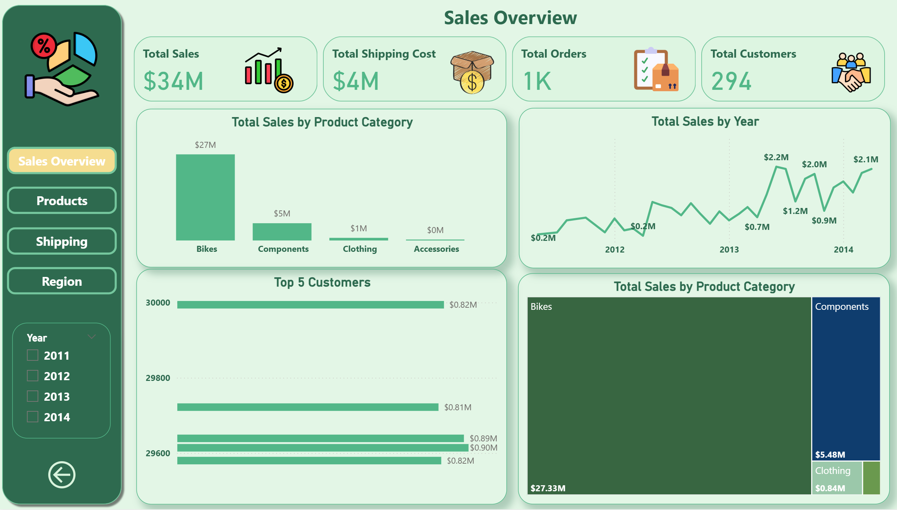
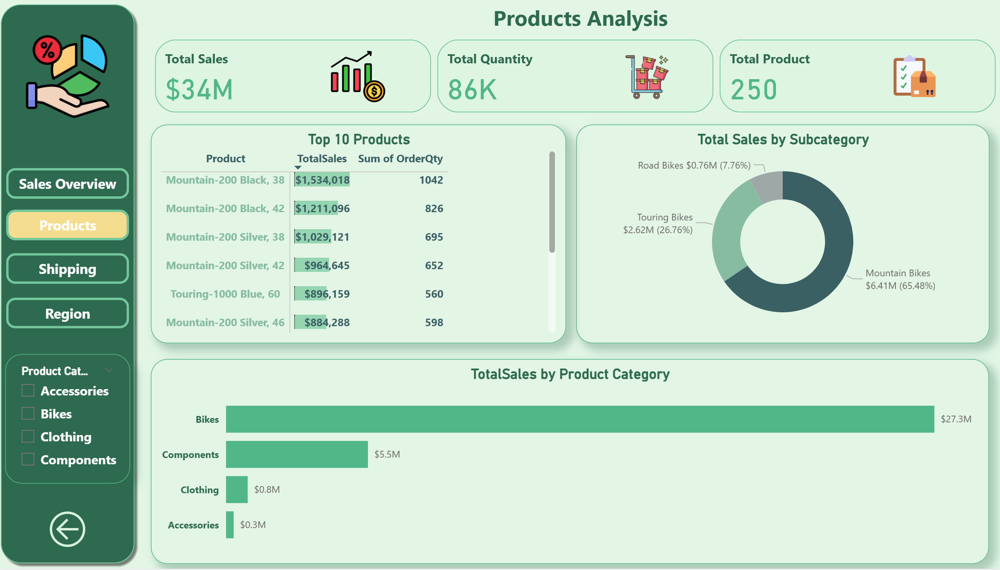
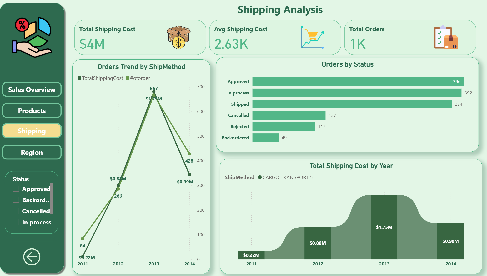
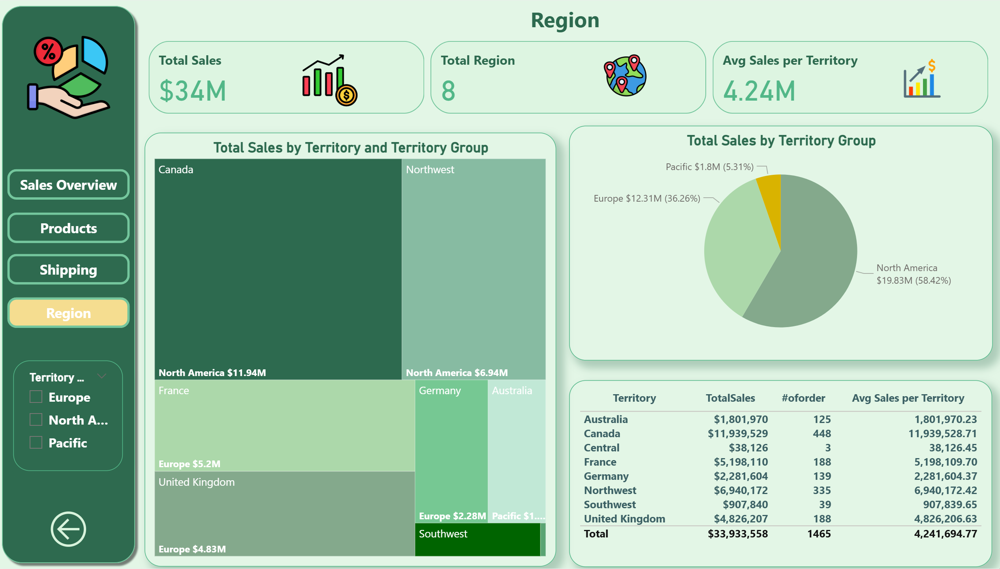

# 📊 Sales Analysis Report Dashboard (Power BI)

## 📌 Overview

An interactive Power BI dashboard analyzing sales, shipping, product, and regional performance for a retail business using the AdventureWorks dataset, covering the period from 2011 to 2014. The dashboard transforms raw sales data into actionable business insights across four dynamic report pages.

## 🎯 Objectives

- Track overall sales performance, orders, and customer growth over time.

- Analyze product and category performance to identify top-selling items.

- Monitor shipping costs and order status to evaluate fulfillment efficiency.

- Break down sales performance by region and territory.

## 🛠️ Tools & Techniques

- **Power BI**

- DAX (Data Analysis Expressions)

- Data Modeling

- Interactive Filters & Slicers

- Dashboard Design & Data Visualization

## 📊 Dashboard Pages

### 1️⃣ Sales Overview

- KPIs: Total Sales ($34M), Total Shipping Cost ($4M), Total Orders (1K), Total Customers (294)

- Total Sales by Product Category

- Total Sales by Year (trend line, 2011–2014)

- Top 5 Customers by sales

### 2️⃣ Products Analysis

- KPIs: Total Sales, Total Quantity (86K), Total Products (250)

- Top 10 Products by sales and quantity

- Total Sales by Subcategory (donut chart)

- Total Sales by Product Category

### 3️⃣ Shipping Analysis

- KPIs: Total Shipping Cost, Avg Shipping Cost, Total Orders

- Orders Trend by Ship Method (2011–2014)

- Orders by Status (Approved, In Process, Shipped, Cancelled, Rejected, Backordered)

- Total Shipping Cost by Year

### 4️⃣ Region

- KPIs: Total Sales, Total Regions (8), Avg Sales per Territory

- Total Sales by Territory and Territory Group (treemap)

- Total Sales by Territory Group (pie chart)

- Full territory breakdown table (Sales, #of Orders, Avg Sales)

## 🔑 Key Insights

- **Bikes** is the dominant product category, generating **$27M+** (about 80% of total sales).

- **North America** leads all regions with **$19.83M (58.42%)** of total sales, followed by Europe at **36.26%**.

- Sales peaked in **2013** with a noticeable spike before dipping slightly in early 2014.

- **Approved, In Process, and Shipped** orders make up the majority of order statuses, while cancellations and rejections remain relatively low.

## 📁 Files
- [⬇️ Download Power BI Project (.pbix)](Power_BI_project.pbix)
  
## 📷 Preview

## 🚀 How to Use

1. Download the `.pbix` file.

2. Open it using Power BI Desktop.

3. Use the Year, Product Category, Status, and Territory filters/slicers to explore the data interactively.

4. Navigate between pages (Sales Overview, Products, Shipping, Region) using the left navigation menu.

## 📈 Future Improvements

- Add year-over-year growth comparison metrics.

- Integrate forecasting for future sales trends.

- Publish dashboard to Power BI Service for online sharing.
